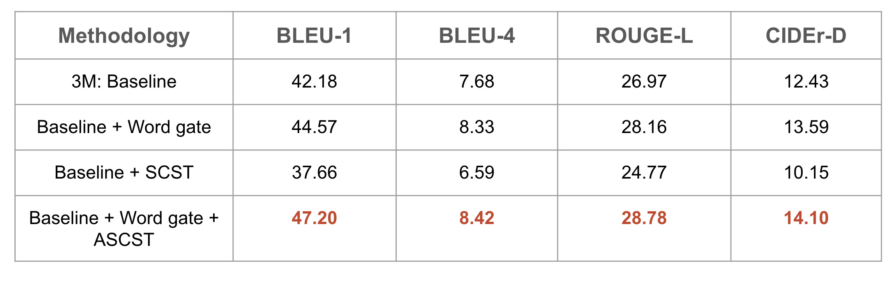

# Multi Modal Multi Updown Personality Image Caption Generator

This project is part of Deep Reinforcement Learning Course offered by CCE IISc 2023. 

## Description
Given an image as input, the model tries to approximately describe the image by generating captions

## Implemented Techniques from Reinforcement Learning
1. Word Gate Model
2. Self Critical Sequence Training with Proximal Policy Optimization (SCST-PPO)
3. Adaptive Self Critical Sequence Training (Adaptive-SCST-PPO)

## PPT/Deck 
Gdrive link - https://docs.google.com/presentation/d/1SCmFXfT_q5RatovdzyCfn-aFAJevO-jawT-O_Z9b4lg/edit?usp=sharing

## Youtube Video of this Webinar
Youtube link - https://youtu.be/lF6xyNUkiKI

## Architecture 


## Metric Improvement using RL Techniques


## Pretrained Features
1. Extract Dense captions features(follow the code by https://github.com/jcjohnson/densecap)
2. ResNext features (We extract them by following the instructions under https://github.com/facebookresearch/ParlAI), the features we used are mean-pooled image  features saved in resnext101_32x48d_wsl/ and spatial feature saved in resnext101_32x48d_wsl_spatial_att/. 

Note: we do not change the network in dense caption or ResNext network, we just directly use the pretrained network to generate our features for stylish captioning task.

## Example script for Data Processing
1. Prepare labels
```
python scripts/prepro_labels.py 
--input_json data/dataset_person.json 
--output_json data/personcap_added1.json 
--output_h5 data/personcap_added1  
--perssOnehot_h5 data/person_onehot_added1 
--densecap_h5 data/densecap_added1 
--personality_path ParlAI/data/personality_captions/personalities.txt
```
We convert original personality caption dataset to dataset_person.json based on the format recommended in https://github.com/ruotianluo/self-critical.pytorch <br />
personalities.txt could be downloaded through https://github.com/facebookresearch/ParlAI by <br />
2. Prepare ngrams
```
python scripts/prepro_ngrams.py 
--rm_punc 0 
--input_json data/dataset_person.json 
--dict_json data/personcap_added1.json 
--split val 
--output_pkl data/person-val
```

3. Prepare reference for evaluation
```
python scripts/prepro_reference_json.py 
--rm_punc 0 
--input_json ParlAI/data/personality_captions/dataset_person.json 
--dict_json data/personcap_added1.json 
--output_json coco-caption/person_captions4eval_-1.json 
--gdindex -1
```

## Training the model
```
python densetrain3m.py --id "densepembed2_added" \
    --caption_model densepembed \
    --decoder_type LSTM \
    --mean_feats 1 \
    --ctx_drop 1 \
    --label_smoothing 0 \
    --input_json data/personalised_captions/training_ids.json \
    --metadata_json data/personalised_captions/i2w_personality_mapping.json \
    --input_label_h5 data/personalised_cap_labels/training_labels.npy \
    --input_label_start_idx data/personalised_cap_labels/training_start_ix.npy \
    --input_label_end_idx data/personalised_cap_labels/training_end_ix.npy \
    --input_fc_dir   data/yfcc_images/resnext101_32x48d_wsl \
    --input_att_dir  data/yfcc_images/resnext101_32x48d_wsl_spatial_att \
    --perss_onehot_h5  data/personalities_onehot/training.npy \
    --densecap_dir data/dense_captions/training.npy \
    --cached_tokens  cider_words/person-train-idxs \
    --start_from log_added_new1/log_"densepembed2_added" \
    --seq_per_img 1 \
    --batch_size 128 \
    --beam_size 1 \
    --learning_rate 2e-4 \
    --num_layers 2 \
    --input_encoding_size 1024 \
    --rnn_size 2048 \
    --att_hid_size 512 \
    --learning_rate_decay_start 0 \
    --scheduled_sampling_start 0 \
    --checkpoint_path log_added_new1/log_"densepembed2_added" \
    --language_eval 0 \
    --val_images_use -1 \
    --max_epochs 15 \
    --scheduled_sampling_increase_every 2 \
    --scheduled_sampling_max_prob 0.5 \
    --learning_rate_decay_every 2 \
    --self_critical_after 15 

```
## Evaluate the model
```
python  denseeval3m.py --id "densepembed2_added" \
    --dump_images 0 \
    --num_images -1 \
    --split test \
    --input_json data/personcap_added1.json \
    --input_label_h5 data/personcap_added1_label.h5 \
    --input_fc_dir   data/yfcc_images/resnext101_32x48d_wsl \
    --input_att_dir   data/yfcc_images/resnext101_32x48d_wsl_spatial_att \
    --perss_onehot_h5  data/person_onehot_added1.h5 \
    --batch_size 1024 \
    --seq_per_img  5 \
    --beam_size 4 \
    --language_eval 1 \
    --infos_path data/infos_"densepembed2_added"-best.pkl \
    --model log_added_new1/log_"densepembed2_added"/model-best.pth \
    --temperature 1.0 
```
